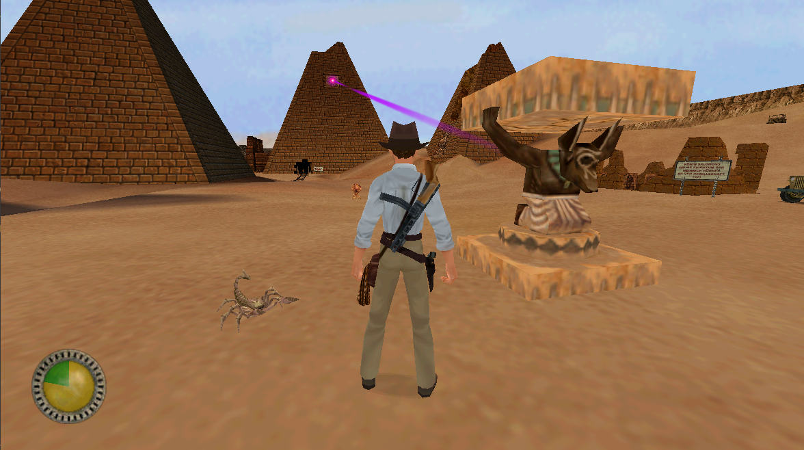

<div align="center">

# 🎮 OpenJones3D
### An open-source dig site for LucasArts' *Jones3D* game engine


**[📥 Latest Releases](https://github.com/smlu/OpenJones3D/releases)** • **[🕹️ Running](#running)** • **[⚙️ Building](#building)** • **[📜 Changelog](CHANGELOG.md)**

[](LICENSE)
[](https://github.com/smlu/OpenJones3D/actions/workflows/build-dx9.yml)
[](https://github.com/smlu/OpenJones3D/actions/workflows/build-dx6.yml)

</div>

<a id="overview"></a>
## 🧭 Overview

**OpenJones3D** is an open-source reimplementation of the **Jones3D** game engine that powers the game ***Indiana Jones and the Infernal Machine*** (***Indiana Jones und der Turm von Babel***). The project aims to rebuild the original engine function by function in C11 based on analysis of the original engine executable binary, together with debug symbols and strings found in the engine, and insights gained from related game engines such as the Sith engine and its derivatives (e.g., GrimE), as well as similar projects like [OpenJKDF2](https://github.com/shinyquagsire23/OpenJKDF2).

This repository does **NOT** include any original game assets. To run or test the project, you need a legal copy of the game from [Steam](https://store.steampowered.com/app/904540?snr=2_9_100000_) or [GOG](https://www.gog.com/en/game/indiana_jones_and_the_infernal_machine), along with the original CD `Indy3D.exe` version 1.0.

<a id="highlights"></a>
## ✨ Highlights

**Renderer and display**
- DirectX 9 renderer port from the original **DirectX 6.1c** backend.
- HLSL shader support with VBO and IBO rendering paths.
- Better modern Windows compatibility, including GDI-related fixes.
- Widescreen support and resolutions above 2048.

**Graphics and UI**

- MSAA, anisotropic filtering, trilinear filtering, and automatic mipmap generation.
- True-color 24/32-bit texture support.
- Original high-poly models enabled by default.
- Sharper text and HUD rendering, plus a refreshed HUD and inventory menu.

**Engine, audio, and stability**

- Settings moved from the Windows Registry into modular `Jones.cfg`.
- Higher-precision frame timing for more reliable behavior on high-refresh-rate systems above 100 FPS.
- Reworked thing and light collection to reduce culling issues and light flicker.
- `linear`, `exponential`, and `logarithmic` software-mixer sound falloff modes.
- Simultaneous sound buffer increased from 32 to 512.
- Numerous bug, crash, and lockup fixes, including inventory-menu issues.

**Gameplay and effects**

- Added customizable auto-aim reticle, which was not present in the original game.
- Blood splatter and richer projectile impact effects.
- Raft wake and water-surface improvements.
- More flexible climbing and swimming movement.
- Restored developer console commands and COG functions.
- AI pathing fixes.

For the complete list of changes and fixes, see [CHANGELOG.md](CHANGELOG.md).

<a id="running"></a>
## 🕹️ Running the Game

### 📋 Requirements

- Original game assets
- `Indy3D.exe` version 1.0
- `sha256: 3fbaf8cd401b4af80967cbe42e3420fb803288b336ebbe72a9a01b6dfd661a53`

### 🪜 Steps

1. Download a release package from the [releases page](https://github.com/smlu/OpenJones3D/releases).
2. Extract it into the game's `<game-install-folder>\Resource` directory, alongside `Indy3D.exe`.
3. Launch `Jones3D.exe`.

> If the game is installed in a system-protected location such as `Program Files`, you may need to run `Jones3D.exe` with administrator rights.
>
> If `Jones.cfg` does not exist on first run, OpenJones3D creates it automatically in the game directory and migrates compatible legacy settings from the Windows Registry into it.
>
> For the available engine configuration options and advanced settings, see [Docs/Jones.cfg.md](Docs/Jones.cfg.md).

<a id="building"></a>
## ⚙️ Building

### 📋 Requirements

- Visual Studio 2022 or newer with C++ desktop development tools
- CMake 3.10 or newer
- Windows SDK
- DirectX 6.1 SDK only if you want the legacy DirectX 6.1c build

### 🛠 Configure and build

#### Build the default DirectX 9 backend

The default build configuration uses **DirectX 9**.
The example below uses the Visual Studio 2022 generator. If you are using a newer Visual Studio release, select the corresponding Visual Studio generator provided by your CMake installation.

```bash
cmake -S . -B build -G "Visual Studio 17 2022" -A Win32
cmake --build build --config Release
```

#### Build the DirectX 6.1c backend

1. Copy the DirectX 6.1 SDK headers and libraries into `Libs\external\DirectX61c\include` and `Libs\external\DirectX61c\lib`.
2. Configure CMake with `JONES3D_USE_DIRECTX9=OFF`:

```bash
cmake -S . -B build -G "Visual Studio 17 2022" -A Win32 -DJONES3D_USE_DIRECTX9=OFF
cmake --build build --config Release
```

If you want CMake to copy the built binaries directly into your game `Resource` folder after each build:

```bash
cmake -S . -B build -G "Visual Studio 17 2022" -A Win32 -DJONES3D_ENABLE_POST_BUILD_COPY=ON -DJONES3D_POST_BUILD_COPY_DIR="<game-install-folder>/Resource"
cmake --build build --config Release
```

### 🧩 CMake options

| Option | Default | Description |
| --- | --- | --- |
| `JONES3D_USE_DIRECTX9` | `ON` | Builds with the DirectX 9 backend. Set to `OFF` to build the legacy DirectX 6.1c backend. |
| `JONES3D_QOL_IMPROVEMENTS` | `ON` | Enables modern quality-of-life fixes and enhancements. Setting it to `OFF` switches the build into the legacy behavior profile. |
| `JONES3D_SPEEDRUN_BUILD` | `OFF` | Enables vanilla quirks and glitches commonly used in speedruns. This is also enabled automatically when QOL improvements are disabled. |
| `JONES3D_BUILD_PROGRAMS` | `ON` | Builds the helper tools under `Programs`. |
| `JONES3D_ENABLE_POST_BUILD_COPY` | `OFF` | Copies `Jones3D.exe`, `Jones3D.dll`, and `Jones3D.pdb` to a target directory after a successful build. |
| `JONES3D_POST_BUILD_COPY_DIR` | empty | Destination directory used by `JONES3D_ENABLE_POST_BUILD_COPY`. |

## 📚 Documentation

- [Docs/COG/README.md](Docs/COG/README.md) for COG scripting language notes and host-function reference pages
- [Docs/Formats/README.md](Docs/Formats/README.md) for engine resource format notes
- [Docs/Architecture/README.md](Docs/Architecture/README.md) for detailed engine architecture notes

<a id="engine-architecture"></a>
## 🏗 High-Level Overview of Engine Architecture
The Jones3D engine is an evolved version of the *Sith* engine, which was also used in games such as *Star Wars Jedi Knight: Dark Forces II* and *Star Wars Jedi Knight: Mysteries of the Sith*. In OpenJones3D, the engine is organized into eight original modules plus one implementation-specific module, [`j3dcore`](Libs/j3dcore).

For a deeper technical breakdown of subsystem ownership, frame execution, rendering, scripting, AI, audio, and `QOL` architecture changes, see [Docs/Architecture/README.md](Docs/Architecture/README.md).

```
              ┌──────────────────────┐
              │       Jones3D        │
              └──────────────────────┘
                         ▲ 
                         |
              ┌──────────────────────┐
              │         sith         │
              └──────────────────────┘
                         ▲ 
                         |
              ┌──────────────────────┐
              │        rdroid        │
              └──────────────────────┘
                         ▲ 
                         |
 ┌───────────┬───────────┬───────────┬───────────┐
 │   sound   │    std    │  wkernel  │  w32util  │
 └───────────┴───────────┴───────────┴───────────┘
```


#### 🔻 Lower Layer Modules
 - [`w32util`](Libs/w32util) - Windows registry module for interacting with the Windows registry
 - [`wkernel`](Libs/wkernel) - Core module that sets up the game window and processes window-specific events
 - [`std`](Libs/std) - LEC's standard library module
   - One part contains general-purpose utility functions such as string copying, file path construction, math, and platform-specific helpers
   - The other part contains lower-level HAL functions for GPU interaction, keyboard and mouse input, network communication, and related systems
 - [`sound`](Libs/sound) - Module that implements the sound HAL interface for audio playback on the system sound device

#### 🔷 Intermediate Layer Modules
 - [`rdroid`](Libs/rdroid) - The RenderDroid module forms the lower layer of the rendering and rasterization system
   - Builds on [`std`](Libs/std) and the other lower-level modules
   - Loads 2D/3D primitives, animations, and textures from files such as [`3DO`](Docs/Formats/3DO.md), [`SPR`](Docs/Formats/SPR.md), [`KEY`](Docs/Formats/KEY.md), and [`MAT`](Docs/Formats/MAT.md)
   - Constructs and updates primitives and animations
   - Manages the rendering pipeline and draws primitives to the screen
   - Contains vector and matrix math functions
 - [`sith`](Libs/sith) - The main gameplay module and the core of the game system
   - Sits on top of the lower and mid-level modules
   - Defines game logic
   - Defines the top-layer rendering pipeline
   - Implements and executes the COG script VM
   - Manages game objects (*things*)
   - Handles data serialization and savegame logic
   - Defines the physics engine
   - Defines the collision system
   - Defines the camera system
   - Defines the AI system

#### 🎯 Top Layer Module
 - [`Jones3D`](Jones3D) - Responsible for initiating the game, game flow management, HUD interface, inventory menu, etc.

<a id="methodology"></a>
## 🔬 Methodology

Most of the research is carried out with reverse-engineering tools such as IDA and Ghidra. Some code and behavior are also cross-referenced with projects such as [OpenJKDF2](https://github.com/shinyquagsire23/OpenJKDF2) and with engines from other games that use, or derive from, the Sith engine, such as *Grim Fandango*.

Function names and most reconstructed data structures follow naming conventions recovered from debug symbols, logging strings, assert messages, related engines, and similar projects. Each function is prefixed with the source file name it was identified with, followed by an underscore and the function name in PascalCase, for example `stdFileUtil_NewFind`, `stdConffile_Open`, and `sithThing_AddSwapEntry`. Similar naming conventions are used for reconstructed data structures. Canonical source file names also retain their original module prefixes, such as `rd` for RenderDroid and `std` for LEC's standard library.

Source and header files are organized into the module directories they belong to and placed in the canonical file paths used by the original engine. Runtime information, such as object addresses in the original binary and function type symbols for each module, is stored in that module's `RTI` directory.

The implementation work is carried out in four phases:

1. First, a shell implementation is created with thunk functions and references to global variables in the original binary (`Indy3D.exe`). This allows functions and variables to be invoked even before their bodies have been reimplemented.
2. Once enough code for specific functions has been reconstructed, the thunk implementations are replaced with real implementations. Function hooks are then added so the engine starts calling the new code.
3. After all functions in a specific file have been implemented, file-local static variables are defined in place of the earlier references to global variables in the original executable.
4. Finally, once all references to public global variables in the engine have been reimplemented, those references are replaced with fully defined `extern` variables.

Overall progress is tracked with the `analyze.py` script, which examines the codebase and counts the number of implemented ("hooked") functions.

<a id="current-state"></a>
## 📈 Current State

The following report is generated by `analyze.py` and shows the implementation progress for the original engine functions present in the final retail v1.0 binary. It excludes any additional functions that exist only in debug builds.
```
Module Progress:
----------------------------------------
rdroid: 100.00% (219/219)
    rdCamera:       100.00% (26/26)
    rdCanvas:       100.00% (3/3)
    rdClip:         100.00% (20/20)
    rdKeyframe:     100.00% (4/4)
    rdLight:        100.00% (4/4)
    rdMaterial:     100.00% (7/7)
    rdPuppet:       100.00% (15/15)
    rdQClip:        100.00% (2/2)
    rdThing:        100.00% (10/10)
    rdroid:         100.00% (10/10)
    rdMath:         100.00% (2/2)
    rdMatrix:       100.00% (25/25)
    rdVector:       100.00% (13/13)
    rdFont:         100.00% (14/14)
    rdModel3:       100.00% (19/19)
    rdParticle:     100.00% (7/7)
    rdPolyline:     100.00% (6/6)
    rdPrimit2:      100.00% (5/5)
    rdPrimit3:      100.00% (2/2)
    rdSprite:       100.00% (3/3)
    rdWallpaper:    100.00% (6/6)
    rdCache:        100.00% (14/14)
    rdFace:         100.00% (2/2)

sith: 88.90% (1666/1874)
    sithAI:                 100.00% (27/27)
    sithAIAwareness:        100.00% (8/8)
    sithAIClass:            100.00% (12/12)
    sithAIInstinct:           0.00% (0/29)
    sithAIMove:              42.22% (19/45)
    sithAIUtil:               0.00% (0/53)
    sithCog:                100.00% (48/48)
    sithCogExec:            100.00% (42/42)
    sithCogFunction:        100.00% (133/133)
    sithCogFunctionAI:      100.00% (60/60)
    sithCogFunctionPlayer:  100.00% (37/37)
    sithCogFunctionSector:  100.00% (25/25)
    sithCogFunctionSound:   100.00% (17/17)
    sithCogFunctionSurface: 100.00% (38/38)
    sithCogFunctionThing:   100.00% (215/215)
    sithCogParse:           100.00% (29/29)
    sithComm:               100.00% (15/15)
    sithConsole:            100.00% (12/12)
    sithControl:            100.00% (24/24)
    sithSound:              100.00% (9/9)
    sithSoundMixer:         100.00% (28/28)
    sithDSS:                  7.69% (2/26)
    sithDSSCog:             100.00% (4/4)
    sithDSSThing:            10.26% (4/39)
    sithGamesave:           100.00% (27/27)
    sithMulti:                3.45% (1/29)
    sithAnimate:            100.00% (50/50)
    sithCamera:             100.00% (26/26)
    sithCollision:          100.00% (27/27)
    sithIntersect:          100.00% (11/11)
    sithParticle:           100.00% (13/13)
    sithPathMove:           100.00% (14/14)
    sithPhysics:             78.72% (37/47)
    sithPuppet:             100.00% (56/56)
    sithRender:             100.00% (22/22)
    sithRenderSky:          100.00% (4/4)
    sithShadow:             100.00% (5/5)
    sithEvent:              100.00% (12/12)
    sithFX:                 100.00% (23/23)
    sithInventory:          100.00% (32/32)
    sithOverlayMap:         100.00% (21/21)
    sithPlayer:             100.00% (17/17)
    sithPlayerActions:      100.00% (42/42)
    sithPlayerControls:     100.00% (28/28)
    sithTime:               100.00% (6/6)
    sithVehicleControls:    100.00% (17/17)
    sithWhip:               100.00% (20/20)
    sithCommand:            100.00% (10/10)
    sithMain:               100.00% (30/30)
    sithString:             100.00% (3/3)
    sithActor:              100.00% (12/12)
    sithExplosion:          100.00% (7/7)
    sithItem:               100.00% (5/5)
    sithMaterial:           100.00% (12/12)
    sithModel:              100.00% (17/17)
    sithPVS:                100.00% (4/4)
    sithSector:             100.00% (19/19)
    sithSoundClass:         100.00% (25/25)
    sithSprite:             100.00% (15/15)
    sithSurface:            100.00% (20/20)
    sithTemplate:           100.00% (15/15)
    sithThing:               95.38% (62/65)
    sithVoice:              100.00% (20/20)
    sithWeapon:             100.00% (48/48)
    sithWorld:              100.00% (23/23)

sound: 92.24% (107/116)
    AudioLib:        10.00% (1/10)
    Driver:         100.00% (37/37)
    Sound:          100.00% (69/69)

std: 100.00% (301/301)
    std:            100.00% (17/17)
    stdBmp:         100.00% (2/2)
    stdCircBuf:     100.00% (4/4)
    stdColor:       100.00% (1/1)
    stdConffile:    100.00% (15/15)
    stdEffect:      100.00% (4/4)
    stdFileUtil:    100.00% (5/5)
    stdFnames:      100.00% (6/6)
    stdHashtbl:     100.00% (12/12)
    stdLinkList:    100.00% (2/2)
    stdMath:        100.00% (10/10)
    stdMemory:      100.00% (11/11)
    stdPlatform:    100.00% (10/10)
    stdStrTable:    100.00% (6/6)
    stdUtil:        100.00% (9/9)
    stdComm:        100.00% (17/17)
    stdConsole:     100.00% (6/6)
    stdGob:         100.00% (13/13)
    stdWin95:       100.00% (5/5)
    std3D:          100.00% (42/42)
    stdControl:     100.00% (37/37)
    stdDisplay:     100.00% (53/53)

w32util: 100.00% (10/10)
    wuRegistry:     100.00% (10/10)

wkernel: 100.00% (8/8)
    wkernel:        100.00% (8/8)

Jones3D: 100.00% (378/378)
    jonesConfig:    100.00% (144/144)
    JonesConsole:   100.00% (18/18)
    JonesDisplay:   100.00% (11/11)
    JonesHud:       100.00% (62/62)
    JonesDialog:    100.00% (21/21)
    JonesFile:      100.00% (22/22)
    JonesMain:      100.00% (63/63)
    jonesString:    100.00% (3/3)
    jonesCog:       100.00% (15/15)
    JonesControl:   100.00% (4/4)
    jonesInventory: 100.00% (15/15)

Overall Progress: 92.53% | Implemented 2689 out of 2906 functions
